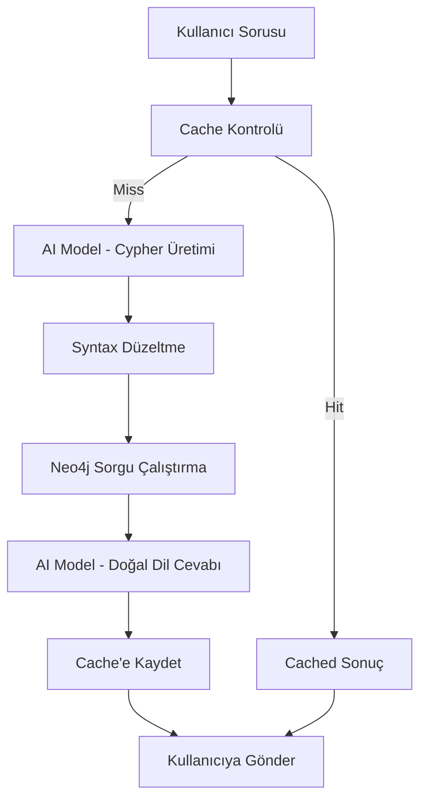

# 🎬 Neo4j RAG Film Chatbot

[](https://python.org)
[](https://flask.palletsprojects.com)
[](https://neo4j.com)
[](LICENSE)

Modern AI ve graf veritabanı teknolojileri kullanarak geliştirilmiş akıllı film sorgulama sistemi. Kullanıcılar doğal dilde sorular sorabilir, sistem bu soruları Neo4j Cypher sorgularına dönüştürür ve anlamlı cevaplar üretir.

## ✨ Özellikler

### 🔥 Temel Özellikler
- **Doğal Dil İşleme**: Türkçe sorularınızı otomatik olarak Cypher sorgularına dönüştürür
- **Çoklu Model Desteği**: Failover sistemi ile farklı AI modelleri arasında otomatik geçiş
- **Akıllı Önbellek**: Performans optimizasyonu için gelişmiş cache sistemi
- **Konuşma Geçmişi**: Son 10 konuşmanızı hatırlar ve bağlam oluşturur
- **Real-time Sağlık Kontrolü**: Neo4j bağlantı durumunu sürekli izler

### 🎯 Gelişmiş Özellikler
- **Otomatik Syntax Düzeltme**: Yanlış Cypher sorgularını otomatik olarak düzeltir
- **Rate Limiting Koruması**: API limitlerini aşmamak için akıllı retry mekanizması
- **Responsive Tasarım**: Mobil ve masaüstü cihazlarda mükemmel görünüm
- **Hata Yakalama**: Kapsamlı error handling ve logging sistemi
- **Güvenlik**: Cypher injection koruması ve input validation

## 🚀 Hızlı Başlangıç

### 📋 Gereksinimler

- **Python 3.8+**
- **Neo4j Desktop** veya **Neo4j Community Server**
- **OpenRouter API Key** ([buradan](https://openrouter.ai) alabilirsiniz)

### ⚡ Kurulum

#### 1. Projeyi İndirin
```bash
git clone <repository-url>
cd neo4j_chat/gemma_rag_chatbot
```

#### 2. Sanal Ortam Oluşturun
```bash
# Windows
python -m venv venv
venv\Scripts\activate

# Linux/MacOS
python3 -m venv venv
source venv/bin/activate
```

#### 3. Bağımlılıkları Yükleyin
```bash
pip install -r requirements.txt
```

#### 4. Neo4j Kurulumu

**Neo4j Desktop ile:**
1. [Neo4j Desktop](https://neo4j.com/download/) indirin ve kurun
2. Yeni bir proje oluşturun
3. "Add Database" → "Create a Local Database"
4. Database'i başlatın
5. Şifreyi not edin

**Docker ile:**
```bash
docker run \
    --name neo4j \
    -p7474:7474 -p7687:7687 \
    -d \
    -v $HOME/neo4j/data:/data \
    -v $HOME/neo4j/logs:/logs \
    -v $HOME/neo4j/import:/var/lib/neo4j/import \
    -v $HOME/neo4j/plugins:/plugins \
    --env NEO4J_AUTH=neo4j/password \
    neo4j:latest
```

#### 5. Ortam Değişkenlerini Ayarlayın

`.env` dosyasını oluşturun ve düzenleyin:
```env
# Neo4j Configuration
NEO4J_URI=bolt://localhost:7687
NEO4J_USER=neo4j
NEO4J_PASSWORD=your_password_here

# OpenRouter API
OPENROUTER_API_KEY=your_api_key_here

# Application Settings
FLASK_DEBUG=False
FLASK_HOST=0.0.0.0
FLASK_PORT=5000
```

#### 6. Örnek Veri Yükleme

Neo4j Browser'da (`http://localhost:7474`) aşağıdaki Cypher komutlarını çalıştırın:

```cypher
// Örnek film verileri
CREATE (matrix:Movie {title: "The Matrix", released: 1999, rating: 8.7})
CREATE (reloaded:Movie {title: "The Matrix Reloaded", released: 2003, rating: 7.2})
CREATE (davinci:Movie {title: "The Da Vinci Code", released: 2006, rating: 6.6})
CREATE (topgun:Movie {title: "Top Gun", released: 1986, rating: 6.9})

// Oyuncular
CREATE (keanu:Person {name: "Keanu Reeves", birthdate: "1964-09-02"})
CREATE (tom:Person {name: "Tom Cruise", birthdate: "1962-07-03"})
CREATE (carrie:Person {name: "Carrie-Anne Moss", birthdate: "1967-08-21"})

// İlişkiler
CREATE (keanu)-[:ACTED_IN {earnings: 40985512}]->(matrix)
CREATE (keanu)-[:ACTED_IN {earnings: 14280931}]->(reloaded)
CREATE (carrie)-[:ACTED_IN {earnings: 11013692}]->(matrix)
CREATE (tom)-[:ACTED_IN {earnings: 5103879}]->(topgun)

// Türler
CREATE (action:Genre {name: "Action"})
CREATE (scifi:Genre {name: "Sci-Fi"})
CREATE (thriller:Genre {name: "Thriller"})

CREATE (matrix)-[:BELONGS_TO_GENRE]->(action)
CREATE (matrix)-[:BELONGS_TO_GENRE]->(scifi)
CREATE (davinci)-[:BELONGS_TO_GENRE]->(thriller)
```

#### 7. Uygulamayı Başlatın
```bash
python app.py
```

Tarayıcınızda `http://localhost:5000` adresine gidin! 🎉

## 📖 Kullanım Kılavuzu

### 💬 Örnek Sorular

| Kategori | Örnek Sorular |
|----------|---------------|
| **Oyuncu Sorguları** | "Matrix filminde kim oynadı?", "Tom Cruise hangi filmlerde oynadı?" |
| **Film Bilgileri** | "2000 sonrası çıkan filmler", "En yüksek puanlı filmler" |
| **Kazanç Bilgileri** | "Keanu Reeves filmlerden ne kadar kazandı?", "En yüksek maaş alan oyuncular" |
| **İstatistik** | "Kaç tane film var?", "Hangi tür en popüler?" |

### 🔍 Gelişmiş Sorgular

```
"Tom Cruise'un en çok kazandığı film hangisi?"
"Matrix serisindeki tüm oyuncuları listele"
"1990-2010 arasında çıkan aksiyon filmleri"
"Keanu Reeves ve Tom Cruise'un ortak oynadığı filmler var mı?"
```

## 🏗️ Proje Mimarisi

```
📦 neo4j_chat/gemma_rag_chatbot/
├── 📄 app.py                 # Ana Flask uygulaması
├── 📄 cache.py               # Akıllı önbellek sistemi
├── 📄 history.py             # Konuşma geçmişi yönetimi
├── 📄 requirements.txt       # Python bağımlılıkları
├── 📄 .env                   # Ortam değişkenleri
├── 📄 .gitignore            # Git ignore kuralları
├── 📁 templates/
│   └── 📄 index.html         # Modern web arayüzü
├── 📁 logs/
│   └── 📄 app.log           # Uygulama logları
└── 📄 README.md             # Bu dosya
```

### 🔄 Veri Akışı



## ⚙️ Yapılandırma

### 🔧 Ortam Değişkenleri

| Değişken | Açıklama | Varsayılan |
|----------|----------|------------|
| `NEO4J_URI` | Neo4j bağlantı adresi | `bolt://localhost:7687` |
| `NEO4J_USER` | Neo4j kullanıcı adı | `neo4j` |
| `NEO4J_PASSWORD` | Neo4j şifresi | - |
| `OPENROUTER_API_KEY` | OpenRouter API anahtarı | - |
| `GEMMA_MODEL` | Ana AI modeli | `google/gemma-3-27b-it:free` |
| `FLASK_PORT` | Uygulama portu | `5000` |
| `CACHE_EXPIRE_HOURS` | Cache süresi (saat) | `24` |

### 🤖 Desteklenen AI Modelleri

1. **google/gemma-3-27b-it:free** (Birincil)
2. **meta-llama/llama-3.1-8b-instruct:free** (Yedek)
3. **microsoft/phi-3-mini-128k-instruct:free** (Yedek)

## 🔒 Güvenlik

### 🛡️ Güvenlik Özellikleri

- **Cypher Injection Koruması**: Tehlikeli komutları engeller
- **Input Validation**: Giriş verilerini doğrular
- **Rate Limiting**: API kötüye kullanımını önler
- **Environment Variables**: Hassas bilgileri güvenli saklar

### 🔐 Production Güvenliği

```bash
# .env dosyasını production'da şifreleyin
export NEO4J_PASSWORD="secure_password"
export OPENROUTER_API_KEY="secure_api_key"
export SECRET_KEY="$(python -c 'import secrets; print(secrets.token_hex())')"
```

## 🚀 Production Deployment

### 🐳 Docker ile Deployment

```dockerfile
FROM python:3.11-slim

WORKDIR /app
COPY requirements.txt .
RUN pip install -r requirements.txt

COPY . .
EXPOSE 5000

CMD ["gunicorn", "--bind", "0.0.0.0:5000", "app:app"]
```

```bash
docker build -t neo4j-chatbot .
docker run -d -p 5000:5000 --env-file .env neo4j-chatbot
```

### ☁️ Cloud Deployment

**Heroku:**
```bash
git add .
git commit -m "Deploy to production"
git push heroku main
```

**Railway/Render:** `.env` dosyasındaki değişkenleri dashboard'dan ekleyin.

## 📊 Performans ve Monitoring

### 📈 Performans Metrikleri

- **Ortalama Yanıt Süresi**: ~2-5 saniye
- **Cache Hit Oranı**: %60-80
- **Neo4j Sorgu Süresi**: <100ms
- **AI Model Yanıt Süresi**: 1-3 saniye

### 🔍 Log Analizi

```bash
# Son hataları görüntüle
tail -f app.log | grep ERROR

# Performans metriklerini izle
tail -f app.log | grep "Query results"

# Cache istatistikleri
grep "Cache" app.log | tail -20
```

## 🧪 Test ve Geliştirme

### 🔬 Unit Tests

```bash
# Test dosyaları oluşturun
mkdir tests
touch tests/test_app.py tests/test_cache.py tests/test_cypher.py

# Testleri çalıştırın
python -m pytest tests/ -v
```

### 🐛 Debug Modu

```bash
export FLASK_DEBUG=True
python app.py
```

## 🤝 Katkıda Bulunma

### 🛠️ Development Setup

```bash
# Repository'yi fork edin
git clone https://github.com/your-username/neo4j-chatbot.git
cd neo4j-chatbot

# Development branch oluşturun
git checkout -b feature/new-feature

# Değişikliklerinizi yapın
# ...

# Commit ve push edin
git add .
git commit -m "Add new feature"
git push origin feature/new-feature

# Pull Request oluşturun
```

### 📝 Katkı Kuralları

1. **Code Style**: PEP 8 standartlarını takip edin
2. **Documentation**: Yeni özellikler için dokümantasyon ekleyin
3. **Testing**: Unit testler yazın
4. **Commit Messages**: Açıklayıcı commit mesajları kullanın

## 🐛 Sorun Giderme

### ❌ Yaygın Hatalar

| Hata | Çözüm |
|------|-------|
| `Neo4j connection failed` | Neo4j servisinin çalıştığını kontrol edin |
| `OpenRouter API rate limit` | API key'inizin limitlerini kontrol edin |
| `Invalid Cypher syntax` | Cache'i temizleyin: `/api/clear-cache` |
| `Port already in use` | Farklı port kullanın: `FLASK_PORT=5001` |

### 🔧 Debug Komutları

```bash
# Neo4j bağlantısını test edin
curl http://localhost:5000/api/health

# Cache'i temizleyin
curl -X POST http://localhost:5000/api/clear-cache

# Log seviyesini artırın
export LOG_LEVEL=DEBUG
```

## 📚 API Referansı

### 🌐 Endpoints

| Method | Endpoint | Açıklama |
|--------|----------|----------|
| `GET` | `/` | Ana sayfa |
| `POST` | `/api/ask` | Soru sorma |
| `GET` | `/api/history` | Konuşma geçmişi |
| `GET` | `/api/health` | Sağlık kontrolü |
| `POST` | `/api/clear-cache` | Cache temizleme |

### 📋 Request/Response Örnekleri

**Soru Sorma:**
```json
POST /api/ask
{
  "question": "Matrix filminde kim oynadı?"
}

Response:
{
  "answer": "Matrix filminde Keanu Reeves, Carrie-Anne Moss...",
  "cypher": "MATCH (p:Person)-[:ACTED_IN]->(m:Movie)...",
  "results": [["Keanu Reeves"], ["Carrie-Anne Moss"]],
  "description": "Matrix filmindeki oyuncuları listeler"
}
```

## 📄 Lisans

Bu proje [MIT Lisansı](LICENSE) altında lisanslanmıştır.

## 🙏 Teşekkürler

- [Neo4j](https://neo4j.com/) - Graf veritabanı teknolojisi
- [OpenRouter](https://openrouter.ai/) - AI model API'si
- [Flask](https://flask.palletsprojects.com/) - Web framework
- [Gemma](https://ai.google.dev/gemma) - Google'ın dil modeli

## 📞 İletişim ve Destek

- 🐛 **Bug Reports**: GitHub Issues
- 💡 **Feature Requests**: GitHub Discussions
- 📧 **Email**: your-email@example.com
- 💬 **Discord**: [Community Server](https://discord.gg/your-server)

---

<div align="center">

**⭐ Bu proje faydalı olduysa yıldız vermeyi unutmayın!**

Made with ❤️ using Neo4j + AI

</div>